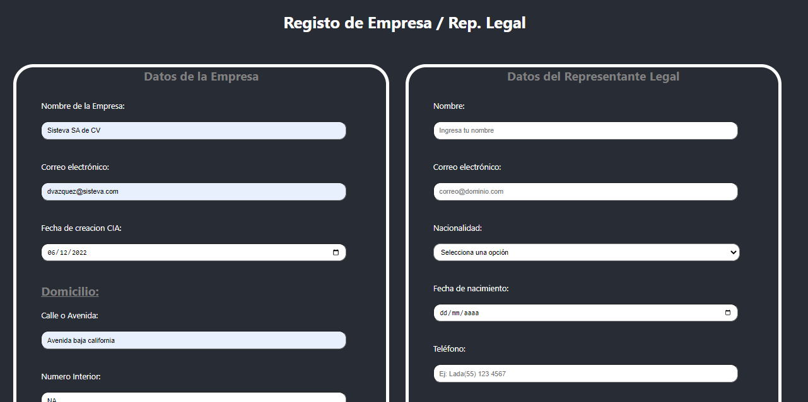

# Challenge Formularios de Representante legal y CIA.

* Repositorio publico para descargar archivo zip o clonar.
* No olvidar realizar npm install para descargar las dependencias antes de correr el proyecto 
* correr con npm start

Proyecto creado con HTML, React, javascript y CSS 

Proyecto de 2 formularios independientes

* Se utilizaron estilos modulares para evitar colisiones de estilos (estilos con hash implementado)
* Se utilizan 2 componentes de React para crear los formularios, pero se muestran en una sola vista.
* La validacion de los formularios esta en el archivo "validacionesForms.js" para re utilizar el codigo para ambos formularios 
* Cada componente se separa y organiza en carpetas independientes, cada una con su archivo JSX, test y CSS 
* EL proyecto esta listo para implementar los test necesarios con Jest version 5.16, queda pendiente porque tomaria mas tiempo la finalizacion del proyecto y no fue requerimiento del challenge, pero puedes correrlos con "npm test"
* Se despliega el proyecto en Netlify con el siguiente enlace: https://stirring-kheer-c3168a.netlify.app/
* Al enviar la informacion o darle enviar o submit, solo envia un mensaje tipo alerta ya que no existe el backend de este proyecto.

